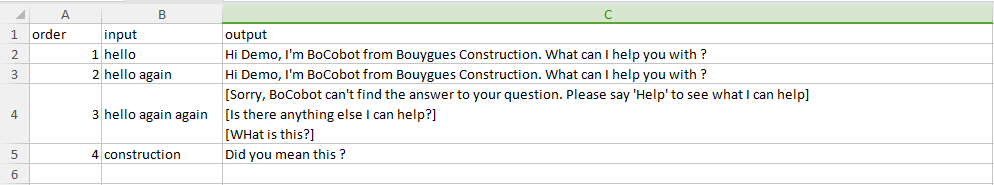
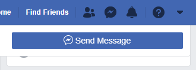
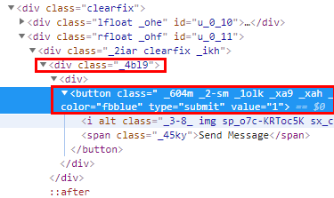
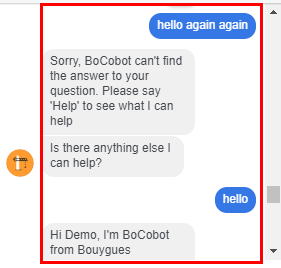
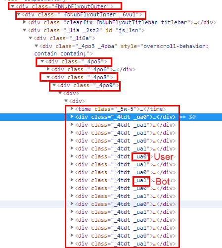
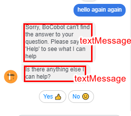
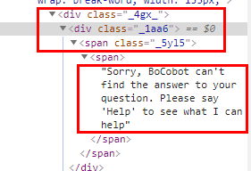

# Testing Facebook messenger chat bot

## Set up

* `yarn install`
* Add file `.env`:
  * EMAIL=myemail@gmail.com
  * PASS=mypassword
* Add Facebook page to test and some settings: `src/settings.json`
* Add `test_cases_name.csv` file to `projects/${projectName}/scenarios`:
  * Fields: [`order`,`input`,`output`]
  * Result at: `projects/${projectName}/scenarios_results`
* Edit `projects/${projectName}/settings.json`:
  * `url`
  * `scenarioFileNames`
  

    
  
## Test

* `yarn test`

## How to get some Facebook messenger selectors (subject to change in the future)

```JavaScript
const selectors = {
  allMessagesSelector:
    '.fbNubFlyoutOuter  .fbNubFlyoutInner  ._1i6a  ._4po5  ._4po8  ._4po9  div._4tdt',
  userMessagesSelector:
    '.fbNubFlyoutOuter  .fbNubFlyoutInner  ._1i6a  ._4po5  ._4po8  ._4po9  div._4tdt._ua0',
  botMessagesSelector:
    '.fbNubFlyoutOuter  .fbNubFlyoutInner  ._1i6a  ._4po5  ._4po8  ._4po9  div._4tdt._ua1',
  lastMessageSelector:
    '.fbNubFlyoutOuter  .fbNubFlyoutInner  ._1i6a  ._4po5  ._4po8  ._4po9  div._4tdt:last-child',
  textMessagesSelector: '._4gx_ ._1aa6 ._5yl5',
  sendMessageButtonSelector: "._4bl9 button[type='submit']",
};
```

* sendMessageButton





* chatMessages





* textMessage




